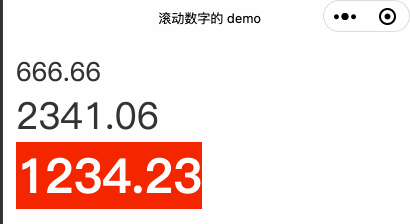

## 滚动的数字



根据传入的数字，已滚动的形式展示。

### 使用方式
下载文件包 **scroll-numbers** 存放于小程序的组件目录中。

```
.
├── app.js
├── app.json
├── app.wxss
├── components
│   └── scroll-numbers
│       ├── scroll-numbers.js
│       ├── scroll-numbers.json
│       ├── scroll-numbers.wxml
│       └── scroll-numbers.wxss
```

在需要使用组件的页面 json 中添加组件，同时可根据实际情况需求重新设定一个 tag 名。

```json
{
  "component": true,
  "usingComponents": {
    "scrollNumber": "/components/scroll-numbers/scroll-numbers"
  }
}
```

在 wxml 文件中，在需要的位置添加代码即可。

```xml
<scrollNumber value="666.66" />
<scrollNumber value="2341.06" inlineFlex="{{false}}" fontSize="{{68}}" />
<scrollNumber custom-number-style="boldFont" value="1234.23" fontSize="{{88}}" inlineFlex="{{true}}" duration="{{200}}" delay="{{50}}" color="#fff" />
```

### 参数列表
| 参数名 | 类型 | 默认值 | 参数说明 |
| :------ | :------ | :------ | :------ |
| value | String | '' | 滚动数字的值 |
| fontSize | Number | 48 | 数字的字符大小，单位为 `rpx` |
| inlineFlex | Boolean | true | 是否使用 `inline-flex` 内联形式的 flex 布局 |
| duration | Number | 200 | 动画的运动时长 |
| delay | Number | 100 | 每个数字运动的延迟时间 |
| color | String | '#333' | 文本的颜色 |
| custom-number-style | String | '' | 组件内部外层样式，可通过改类名定义更多的文本样式 |

### 注意事项
* `fontSize`、`inlineFlex`、`duration`、`delay` 以及 `color` 的属性值直接作用于 `style` 属性中，因此当使用 `custom-number-style` 类名时，需要注意权重；
* 主要采用 Flex 方式布局，整体的 `display` 可通过 `inlineFlex` 控制：`display: inline-flex;` 或者 `display: flex;`；
